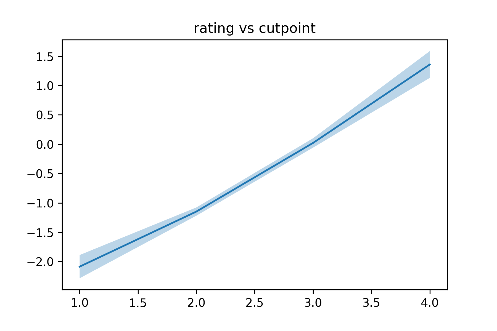

.. currentmodule:: myfm
.. _OrdinalRegression:

----------------------------
Ordinal Regression Tutorial
----------------------------

.. _OrdinalUCLA:

UCLA Dataset
^^^^^^^^^^^^^^^^^^^^^^

Let us first explain the API of :py:class:`myfm.MyFMOrderedProbit`
using `UCLA dataset <https://stats.idre.ucla.edu/r/dae/ordinal-logistic-regression/>`_.

The data description says

    This hypothetical data set has a three level variable called apply, with levels “unlikely”, “somewhat likely”, and “very likely”, coded 1, 2, and 3, respectively, that we will use as our outcome variable. We also have three variables that we will use as predictors: pared, which is a 0/1 variable indicating whether at least one parent has a graduate degree; public, which is a 0/1 variable where 1 indicates that the undergraduate institution is public and 0 private, and gpa, which is the student’s grade point average. 

We can read the data (in Stata format) using pandas: ::

    import pandas as pd
    df = pd.read_stata("https://stats.idre.ucla.edu/stat/data/ologit.dta")
    df.head()

It should print

.. csv-table::
    :header-rows: 1

    ,apply,pared,public,gpa
    0,very likely,0,0,3.26
    1,somewhat likely,1,0,3.21
    2,unlikely,1,1,3.94
    3,somewhat likely,0,0,2.81
    4,somewhat likely,0,0,2.53

We regard the target label ``apply`` as a ordinal categorical variable, 

.. math::
    (\text{unlikely} = 0) < (\text{somewhat likely} = 1) < (\text{very likely} = 2)

so we map ``apply`` as ::

    y = df['apply'].map({'unlikely': 0, 'somewhat likely': 1, 'very likely': 2}).values

Prepare other features as usual. ::

    from sklearn.model_selection import train_test_split
    from sklearn import metrics

    X = df[['pared', 'public', 'gpa']].values
    X_train, X_test, y_train, y_test = train_test_split(X, y, test_size=0.2, random_state=42)

Now we can feed the data into :py:class:`myfm.MyFMOrderedProbit`. ::

    from myfm import MyFMOrderedProbit
    clf = MyFMOrderedProbit(rank=0).fit(X_train, y_train, n_iter=200)

    p = clf.predict_proba(X_test)

    print(f'rmse={metrics.log_loss(y_test, p)}')
    # 0.8403, slightly better than constant model baseline.
    print(f'p={p}')
    # a 2D array

Note that unlike binary probit regression, :py:meth:`MyFMOrderedProbit.predict_proba` 
returns 2D (N_item x N_class) array of class probability.

Movielens ratings as ordinal outcome
^^^^^^^^^^^^^^^^^^^^^^^^^^^^^^^^^^^^

Let us now turn back to :ref:`Movielens 100K tutorial <MovielensIndex>`.

Although we have treated movie ratings as a real target variable
and used :py:class:`MyFMRegressor`, it is more natural to regard them
as ordinal outcomes, as there are no guarantee that the difference between rating 4 vs 5
is equivalent to the one with rating 2 vs 3.

So let us see what happens if we instead use :py:class:`MyFMOrderedProbit` to predict the rating.
If you have followed the steps through :ref:`the previous ''grouping'' section <grouping>`,
you can train our ordered probit regressor by::

    fm_grouped_ordered = myfm.MyFMOrderedProbit(
        rank=FM_RANK, random_seed=42,
    )
    fm_grouped_ordered.fit(
        X_train, y_train-1, n_iter=300, n_kept_samples=300,
        group_shapes=[len(group) for group in ohe.categories_]
    )

Note that we have used ``y_train - 1`` instead of ``y_train``,
because rating ``r`` should be regarded as class ``r-1``.

We can predict the class probability given ``X_test`` as ::

    p_ordinal = fm_grouped_ordered.predict_proba(X_test)

and the expected rating as ::

    expected_rating = p_ordinal.dot(np.arange(1, 6))
    rmse = ((y_test - expected_rating) ** 2).mean() ** .5
    mae = np.abs(y_test - expected_rating).mean()
    print(f'rmse={rmse}, mae={mae}')

which gives us RMSE=0.8906 and MAE=0.6985, a slight improvement over the regression case.

To see why it had an advantage over regression, let us check
the posterior samples for the cutpoint parameters.
You can access them via ``fm_grouped_ordered.predictor_.samples``: ::

    cutpoints = np.vstack(
        [ fm.cutpoints[0] - fm.w0 for fm in fm_grouped_ordered.predictor_.samples]
    )

You can see how rating boundaries vs cutpoints looks like. ::

    from matplotlib import pyplot as plt
    cp_mean = cutpoints.mean(axis=0) 
    cp_std = cutpoints.std(axis=0)

    plt.plot(np.arange(1, 5), cp_mean);
    plt.fill_between(
        np.arange(1, 5), cp_mean + 2*cp_std, cp_mean - 2 * cp_std,
        alpha=0.3
    )
    plt.title('rating boundary vs cutpoint')

This will give you the following figure. The line is slightly non-linear,
which may explain the advantage of the formulation in ordinal regression.

